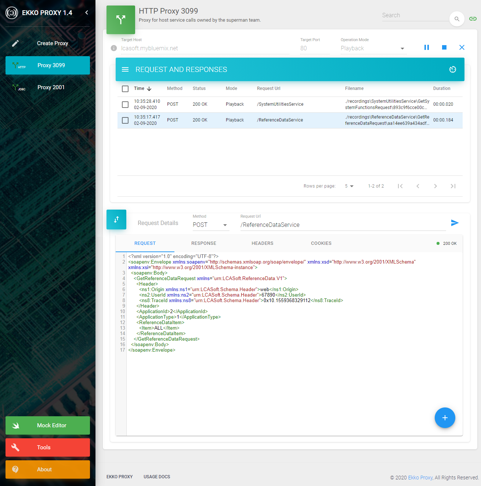

# EKKO PROXY 1.5

Ekko Proxy aka Echo Proxy is a Web Service Proxy service virtualization tool to monitor, record, playback and mock 
web services and JDBC database calls.

It supports virtualization of messaging protocols like JSON and SOAP over HTTP/HTTPS protocols as well as JDBC.

Every software developer should really have an Ekko Proxy tool in their toolbox given it provides many benefits such as:

* Validate APIs / JDBC calls early in the project by recording requests and playing back recorded or mocked responses.
* Run your application on the go without requiring network access to backend systems / databases.
* Simulate a variety of responses to test hard to replicate scenarios or error conditions.
* Minimize dependencies between service delivery teams allowing for a truly agile delivery model.
* Load test applications or APIs without incurring potential costs associated with rate limits.
* Increase development and testing time by reducing dependency on backend systems availability.
* Integrate your application with dependent APIs or DBs before they are fully built.
* Run various tools to compare, encode/decode, format, match, and hash data, validate / encode JWT tokens
  \- all safely from your local machine or server without the inherent dangers of using similar online tools.
* Save time by generating mocks automatically from HTTP requests, OpenAPI, Swagger or WSDL specifications.

Many service virtualization tools have a steep learning curve and can be cumbersome to setup. 
Ekko Proxy is not one of them - instead, using it's intuitive and simple UI, you can get setup and running in minutes.

There are many great features in Ekko Proxy - some of which are listed below:

* Get up and running in minutes - no coding or complex setup required.
* Create mock responses for API and DB calls with the [Ekko Proxy WireMock Editor](https://github.com/lcasoft/WireMock).
* Record and playback requests and responses as they pass through Ekko Proxy.
* View and compare requests or responses as they flow through Ekko Proxy instances.
* Set delay ranges to simulate real response times for responses being played back.
* Configure expressions to organise recorded requests and responses in subfolders so you can easily find them.
* Configure expressions to normalize requests for better matching with recorded responses.
* Drag & drop recorded HTTP requests to a proxy to fire them at the target server.
* Easily view the contents of JWT tokens along with validating their signature or encode new ones.
* View, manage, resend existing recorded requests from the recordings drawer.
* Import / export proxy settings, recordings or mocks.
* Generate mocks straight from HTTP requests or from OpenAPI, Swagger or WSDL definitions.

Ekko Proxy example with four running proxies:



For detailed documentation, please see: [Ekko Proxy Home Page](https://www.ekkoproxy.com).

## New in Version 1.5
* Added option to generate mocks from http requests / responses.
* A new tool to generate mocks directly from OpenAPI / Swagger has been added.
* A new tool to generate mocks directly from WSDL files has been added.
* Spring boot actuator has been configured and HTTP metrics for proxies are now recorded.
* Added suggestions for headers when configuring mocks.
* Content encoding now supports deflate and br (Brotli) on some operative systems.
* Delays are now supported for JDBC mocks.
* Various minor fixes and UI updates.
* Added log file viewer in About page.
* Added charting of requests / responses.

## Version 1.4 changes
* Added a new database proxy type for JDBC connections. This allows you to view JDBC calls and record or mock their responses.
* Added inline search in text areas with highlighting.
* See the proxy settings for a proxy in a new information tooltip.
* Fixed missing response headers when using forwarding.
* You can now install license files via the UI.
* Added command line option to specify corporate proxy settings for external connections.
* You can now upload a SSL certificate for a proxy making it easier to manage when running on a remote server.
* Added option to import / export Ekko Proxy settings, recordings and mocks via the UI.
* New tools SQL formatting option.
* When creating a Ekko proxy the ports for which existing settings already exist are displayed as a suggestion.


## Install

**Prerequisites:** Java 8 or later.

To install Ekko Proxy simply clone or download the ekkoproxy jar to your machine or to a server.


### Run
Ekko Proxy can be started using the command:

```bash
java -jar ekkoproxy-1.5.jar
```
This starts up the Ekko Proxy server and by default the Ekko Proxy UI can be accessed on http://localhost:4040 or http://&lt;server&gt;:4040 if installed on a server.

You can override application settings on the command line, as in the example below, that specifies which port Ekko Proxy should be accessible on:

```bash
java -jar ekkoproxy-1.5.jar -server.port=8080
```

Further details can be found on the [Ekko Proxy Home Page](https://www.ekkoproxy.com).

## Usage
Ekko Proxy is used by placing it in-between a client application and a server. The client is 
configured to connect to Ekko Proxy, and Ekko Proxy forwards, records or plays back the data from the server / database, 
depending on mode of operation, along-with providing easy access to view and compare the requests / responses etc. 
in its user interface.

Please see the [Ekko Proxy Home Page](https://www.ekkoproxy.com) homepage for the full usage documentation.

## Bugs & Enhancements
Please use the github Issues tab to raise any bugs or enhancement requests.

## License
CC BY-NC-ND 4.0 International, please see full license here: [LICENSE](https://www.ekkoproxy.com/eula.html).
