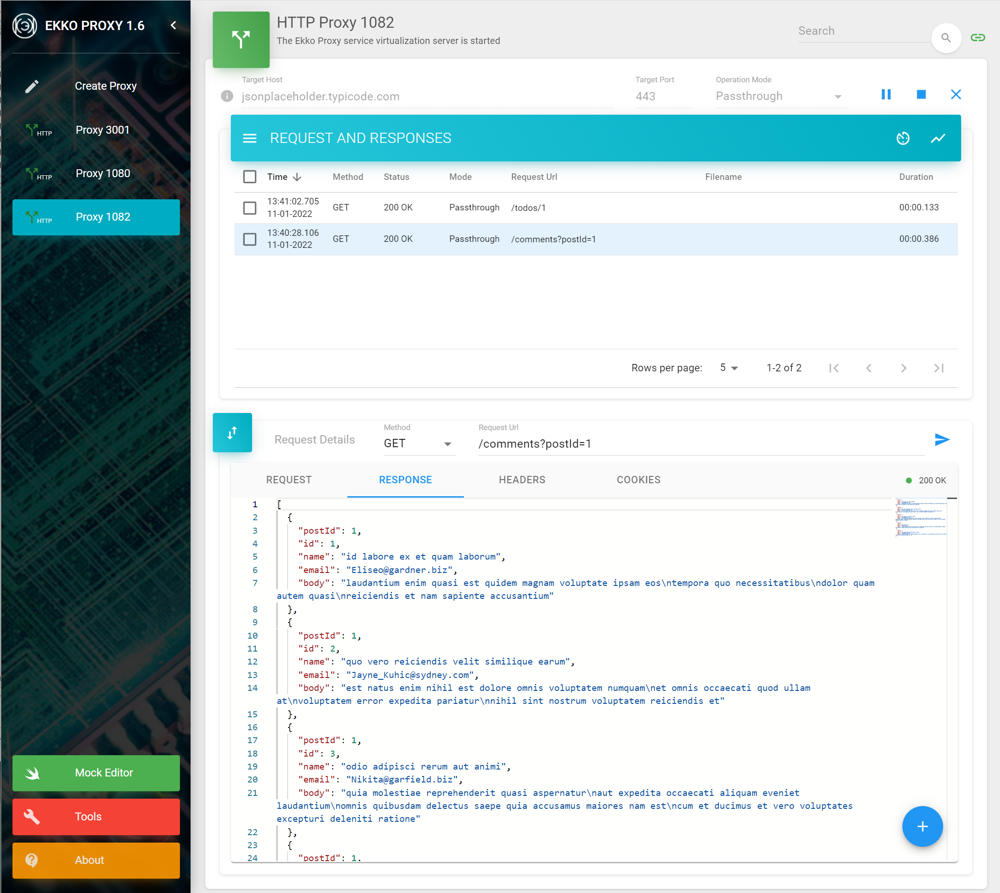

# EKKO PROXY 1.3.1

Ekko Proxy aka Echo Proxy is a Web Service Proxy service virtualization tool to monitor, record, playback and mock web services.

It supports virtualization of messaging protocols like JSON and SOAP over HTTP/HTTPS protocols.

Every software developer should really have an Ekko Proxy tool in their toolbox given it provides many benefits such as:

* Validate APIs early in the project by recording requests and playing back recorded or mocked responses.
* Run your application on the go without requiring network access to backend systems.
* Simulate a variety of responses to test hard to replicate scenarios or error conditions.
* Minimize dependencies between service delivery teams allowing for a truly agile delivery model.
* Load test applications or APIs without incurring potential costs associated with rate limits.
* Increase development and testing time by reducing dependency on backend systems availability.
* Integrate your application with dependent APIs before they are fully built.
* Run various tools to encode/decode, format, match, and hash data, validate / encode JWT tokens
  \- all safely from your local machine or server without the inherent dangers of using similar online tools.

Many service virtualization tools have a steep learning curve and can be cumbersome to setup. 
Ekko Proxy is not one of them - instead, using it's intuitive and simple UI, you can get setup and running in minutes.

There are many great features in Ekko Proxy - some of which are listed below:

* Get up and running in minutes - no coding or complex setup required.
* Create virtual APIs with the [Ekko Proxy WireMock Editor](https://github.com/lcasoft/WireMock).
* Record and playback requests and responses as they pass through Ekko Proxy.
* View and compare requests or responses as they flow through Ekko Proxy instances.
* Set delay ranges to simulate real response times for responses being played back.
* Configure expressions to organise recorded requests and responses in subfolders so you can easily find them.
* Configure expressions to normalize requests for better matching with recorded responses.
* Drag & drop recorded requests to a proxy to fire them at the target server.
* Easily view the contents of JWT tokens along with validating their signature or encode new ones.
* View, manage, resend existing recorded requests from the recordings drawer.

Ekko Proxy example with two running proxies:



For detailed documentation, please see: [Ekko Proxy Home Page](https://www.ekkoproxy.com)

## New in Version 1.3.1
Minor release with only UX improvements - including:
* Added syntax highlighting for XML, JSON and JWT.
* Left-hand drawer is now collapsible.
* Added speed dial menu to proxy request and response panes with word wrap and formatting options.

## New in version 1.3

* Various minor bug fixes and improvements.
* Added tooling for comparing, encoding, formatting, hashing, JWT and matching data.
* Redesigned the proxy message details section to provide a more detailed view.
* Added new Recordings drawer to the proxy view for management of recordings.
* Listener port can now accept SSL connections.
* Added support for JsonPath expressions.
* Added Auto output format for displaying messages formatted based on the content-type header.
* HTTP messages are now saved raw with an option to save them formatted.


## Install

**Prerequisites:** Java 8 or later.

To install Ekko Proxy simply clone or download the ekkoproxy jar to your machine or to a server.


### Run
Ekko Proxy can be started using the command:

```bash
java -jar ekkoproxy-1.3.1.jar
```
This starts up the Ekko Proxy server and by default the Ekko Proxy UI can be accessed on http://localhost:4040 or http://&lt;server&gt;:4040 if installed on a server.

You can override application settings on the command line, as in the example below, that specifies which port Ekko Proxy should be accessible on:

```bash
java -jar ekkoproxy-1.3.1.jar -server.port=8080
```

Further details can be found on the [Ekko Proxy Home Page](https://www.ekkoproxy.com)

## Usage

Ekko Proxy is used by placing it in-between a client application and a server. The client is 
configured to connect to Ekko Proxy, and Ekko Proxy forwards, records or plays back the data from the server, 
depending on mode of operation, along-with providing easy access to view and compare the requests / responses etc. 
in its user interface.

Please see the [Ekko Proxy Home Page](https://www.ekkoproxy.com) homepage for the full usage documentation.

## Bugs & Enhancements
Please use the github Issues tab to raise any bugs or enhancement requests.

## License
CC BY-NC-ND 4.0 International, please see full license here: [LICENSE](https://www.ekkoproxy.com/eula.html).
